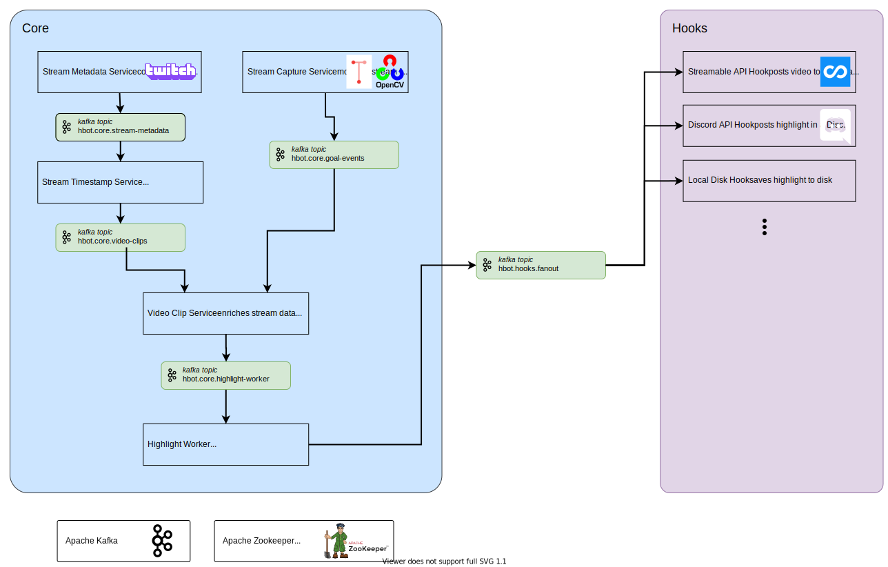

# highlight-bot


> highlight bot is a platform that uses AI to automagically create highlight videos from live FIFA 20 gameplay when goals are scored. It's written in Python and Kotlin with Kafka as the real-time message broker.

**Contents**

- [Demo](#demo)
  - [Jupyter Notebook](#jupyter-notebook)
- [Architecture](#architecture)
    - [The Microservices: Explained](#the-microservices-explained)
    - [The Hooks: Explained](#the-hooks-explained)
- [Installation](#installation)
- [Usage](#usage)
- [Additional Theoretical Features](#additional-theoretical-features)
- [TODO](#todo)
- [License](#license)

## Demo

highlight bot works by programatically monitoring frames of a live Twitch stream (with the Twitch API) of FIFA gamelay (the popular FUT game mode only). When it detects a goal, the ~20 seconds with the build up to the goal are clipped as a highlight clip. The highlight clip is saved to disk and a message is broadcast to various Hooks that take the video and complete some action (example: upload to a video hosting site, post the link in a groupchat, etc.). Highlight bot is extensible, so other hooks can be easily added by monitoring a kafka topic. All of this is stateless and everything happens in memory, no writes to disk (other than [Apache Kafka](https://kafka.apache.org/documentation/#introduction)'s internals and writing the final highlight clip).

<p align="center">
  <a href="https://assets.noahbass.com/highlight-bot-demo.mp4" target="_blank">
    
  </a>
</p>

### Jupyter Notebook

[Jupyter Notebook](https://colab.research.google.com/drive/1HMqXU__RH-Q7XgvqvEOlkHwx7U-I4M23?usp=sharing): A notebook showing a rudimentery example of the image processing and OCR required for analyzing a frame of gameplay.

## Architecture

<p align="center">
  
</p>

highlight bot is designed as a set of independent microservices, each with a unique role - from detecting goals with OCR to creating highlight videos. The microservices are arranged as a streaming data pipeline connected via [Apache Kafka](https://kafka.apache.org/documentation/#introduction) topics. Kafka is a real-time message broker that persists messages in an ordered queue so consumers can reliably access ordered data from a streaming data pipeline (order is important for this application). Because Kafka is fault tolerant, failed messages in the system are retried and the message queue is saved in the event that the message broker goes down. *Sidenote: Kafka is a distributed streaming platform that is highly durable, scalable, and resilient. However, in this application, Kafka is used mostly its real-time data streaming with single partitions, and not so much for its scalability/distributed features.*

highlight bot is somewhat designed to scale. Theoretically, with some minor code modifications in messaging metadata for Kafka, highlight bot could watch multiple Twitch streams at once.

Because of the modular design, the stream capture service could be swapped out for a lookalike service to detect events in other video games (or other feature detection techniques in live video feeds).

As mentioned before, highlight bot is extensible, so more hooks (a type of service) can be added by the user. Each hook uses a different [Kafka consumer group identifier](https://kafka.apache.org/documentation/#intro_consumers) that subscribes to the `hbot.hooks.fanout` topic (thereby emulating a [fan-out/broadcast](https://en.wikipedia.org/wiki/Fan-out_(software))).

### The Core Microservices: Explained

highlight bot's 5 core microservices are simple, independent services that perform just one task. Each service is either a producer, consumer, or both producer and consumer. Producers push data to a Kafka topic (stream). Consumers subscribe to a Kafka topic (or many Kafka topics) and data. Each microservice is Dockerized and runs with docker-compose.

- stream-capture-service (Python): Monitors frames from the Twitch stream for events. It uses the [Tesseract OCR](https://github.com/tesseract-ocr/tesseract) and [tesserocr module](https://github.com/sirfz/tesserocr) to determine the score, time, and other game state information from the frames. Gameplay from Twitch is streamed in by the [streamlink module](https://streamlink.github.io/).
- stream-metadata-service (Python): Collects stream metadata from the Twitch stream. The actual video from the stream isn't downloaded until the data reaches the highlight worker, therefore limiting the work the system needs to do to only essential tasks.
- stream-timestamp-service (Python): Processes, cleans, and trims Twitch m3u8 stream data (gets it ready for the Video clip service).
- video-clip-service (Kotlin): Enriches Twitch stream data with stream events (such as a goal event). When an event happens and stream data is available, the video clip service sends the metadata to the highlight worker. This service was written in Kotlin because I though it would be fun to use Kotlin (it was).
- highlight-worker (Python): The highlight worker downloads the video data needed for the highlight clip, saves the clip to a local volume, then sends a fanout message to any hooks that may be listening.

Other services:

- video-clip-service-old (Python): A version of the video clip service written in Python. It is functionally equivalent to the service written in Kotlin, but is no longer used.

### The Hooks: Explained

Hooks are a special type of service in the highlight bot platform.

Hooks recieve messages in a fanout/broadcast from the highlight worker. To participate as a consumer in the broadcast, each hook identifies itself with a unique Kafka consumer group identifier. Due to this fanout design, an unlimited number of hooks can be added to highlight bot.

- streamable-api-hook (Python): This hook consumes the payload from the highlight-worker, reads the respective clip from the shared volume, uploads the clip to Streamable, then returns the Streamable url.
- discord-api-hook (TODO): Not yet implemented. This hook posts the clip to a Discord chat.

## Installation

highlight bot requires [Docker](https://www.docker.com/products/docker-desktop).

```sh
$ git clone git@github.com:noahbass/highlight-bot.git
$ cd highlight-bot
```

## Usage

To detecting goals and generating highlight clips:

```sh
$ cp .env.example .env
$ nano .env # edit the CHANNEL_NAME variable and the streamable variables (if using the streamable api hook)
$ docker-compose up # this could take a while on first run
# use control+c to stop
```

To cleanup after usage (removes leftover containers, volumes, and networks):

```sh
$ docker-compose down -v
```

## Additional Theoretical Features

As previously mentioned, highlight bot is extensible. Because of the modular design, any of the services can be swapped out or modified to support other features. Some of these are trivial, some are nontrivial:

- Scale up the highlight worker so multiple highlight videos can be created at once
- Scale up the stream-capture-service and stream-metadata-service so the system can monitor more than one Twitch stream. This would require modifying the Kafka messages to include metadata for stream identification and possibly better/more hardware.
- Use this system as a general purpose event-driven stream clipper. Modify the stream-capture-service to use OCR for more than just goal events in FIFA.
- Use S3 (or similar) for intermediate and long-term storage between the highlight worker and the hooks
- and much more

## TODO

- [ ] Use Protobuf (or similar library) to create and maintain stable contracts between the microservices (aka API contracts)
- [ ] Write a highlight cleaner to remove old video clips from the shared highlight worker volume
- [ ] Clean up the code for the Python Kafka producer-consumer pattern (perhaps make a shared module for the pattern)
- [ ] Identify in the stream when the game is currently being played and when the game is not being played (reduce the amount of wasted CPU time on performing OCR on useless frames)
- [ ] Better timestamp sync between Stream Capture Service and Stream Metadata Service
- [ ] Scale the number of highlight workers (so multiple highlight videos can be processed in parallel)
- [ ] Better logging and platform monitoring (Kafka, the services, etc.)
- [ ] Clean up some WET Python code
- [ ] Prettify event sending from the stream-capture-service
- [ ] Fix timestamp manipulation (with `pytz`) in the highlight worker
- [ ] Formalize the stream capture services and Kafka topics
- [ ] Reduce the size of the Docker images
- [ ] Create a user friendly web interface for configuring and monitoring highlight bot
- [ ] Add scalability for detecting goals from multiple streams at once
- [ ] Anaylze CPU usage of the services (the stream capture service in particular)

## License

[MIT](LICENSE)
